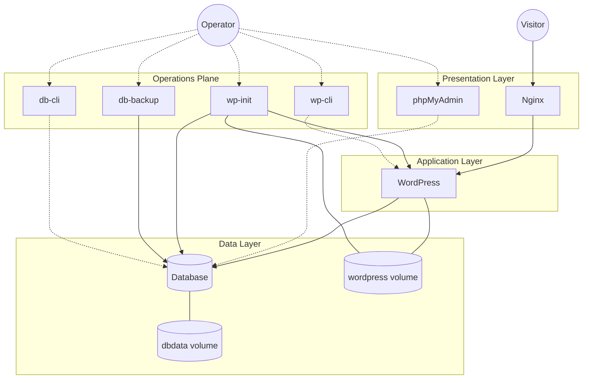

# WordPress Docker Stack

## Contents

- [Overview](#overview)
- [Typical Use Cases](#typical-use-cases)
- [Quick Start](#quick-start)
- [Configuration](#configuration)
- [Operational Interface](#operational-interface)
- [Architecture & Workflow](#architecture--workflow)
- [Design Decisions](#design-decisions)
- [Quality Gates and CI](#quality-gates-and-ci)
- [Contributions](#contributions)

## Overview

A Docker Compose–based WordPress environment focused on automation,
reproducibility, and separation of concerns.

This repository provides a structured and repeatable way to run and operate
WordPress using containers. All lifecycle tasks are handled through explicit
configuration and script-driven automation, keeping application runtime and
infrastructure responsibilities clearly separated.

The stack addresses common issues in containerized WordPress setups, such as
implicit initialization logic, environment drift, and hard-to-audit automation,
while remaining extensible for more advanced development and migration
scenarios.

## Typical Use Cases

This project supports multiple workflows that commonly emerge when working with WordPress:

1. **Fresh WordPress setup**  
   Run a new WordPress instance with minimal configuration using Docker Compose and environment variables.

2. **Import an existing WordPress project**  
   Reuse an existing WordPress installation by:
   - placing a database dump in `db/init/`
   - copying `wp-content` files into `src/`

   The database is automatically initialized on first startup or restored manually when needed.

3. **Environment migration and site URL synchronization**  
   When importing an existing database, the site URL stored in WordPress may not match the current environment (domain or port).  
   A dedicated initialization service detects the current site URL and synchronizes it with the configured environment to prevent redirect and startup issues.

4. **Continuous database safety**  
   Database content is backed up automatically at configurable intervals using a FIFO rotation policy.  
   Backups and on-demand snapshots can also be triggered manually.

Once a relevant workflow is identified, the stack can be started and operated
with a minimal setup.

## Quick Start

This section provides the fastest path to a running environment using the
default configuration.

### Prerequisites

- Docker
- Docker Compose
- GNU Make

### Setup

Clone the repository and initialize the configuration:

```sh
git clone <repository-url>
cd wp-docker-stack
cp .env.example .env 
```

### Start the stack

Orchestrate and launch all services:

```sh
make up
```

### Access the services

- **WordPress:** Accessible at `http://<SERVER_NAME>:<HTTP_PORT>` as configured in your `.env` file.
- **Database Management:** Available via the database CLI (`db-cli`) or optional GUI tools such as phpMyAdmin.

### Stop the stack

Gracefully shut down all running services:

```sh
make down
```

## Configuration

The stack is driven by environment variables defined in the `.env` file. This approach keeps configuration explicit and avoids hardcoded values inside scripts or compose files.

### 1. Core Stack Settings

| Variable | Description |
| :--- | :--- |
| `CONTAINER_NAME` | Prefix used for all containers in the stack (e.g., `app`). |
| `SERVER_NAME` | Domain or hostname for the application (e.g., `localhost`). |
| `HTTP_PORT` | Host port mapped to the Nginx entry point (e.g., `8000`). |

### 2. Database Configuration

Configures the MySQL instance used by both the DB engine and WordPress.

- `DATABASE_NAME`, `DATABASE_USER`, `DATABASE_PASSWORD`

- `DATABASE_ROOT_PASSWORD`: Required for administrative tasks and CLI operations.

### 3. WordPress Initialization

Handles the automated setup and URL synchronization to ensure the site is always reachable.

- `SKIP_WP_INIT`: Set to `true` to disable the initialization service during `make up`.

- `SITE_URL`: The target WordPress URL. Supports dynamic expansion (e.g., `http://${SERVER_NAME}:${HTTP_PORT}`).

- `SKIP_COLUMNS`: Columns to exclude during the automated `search-replace` process (default: `guid`).

### 4. Database Backup Service

Manages automated snapshots and implements a data safety policy.

- `SKIP_DB_BACKUP`: Set to `true` to disable the automated backup service during `make up`.

- `DATABASE_BACKUP_MAX_FILES`: Number of historical snapshots to keep (**FIFO rotation policy**).

- `DATABASE_BACKUP_INITIAL_DELAY`: Wait time before the first backup (supports `s/m/h/d`, e.g., `60s`).
- `DATABASE_BACKUP_INTERVAL`: Frequency of subsequent backups.

### 5. Management Tools (Optional)

- `PHPMYADMIN_PORT`: Host port for the optional phpMyAdmin web interface.

## Operational Interface

The `Makefile` provides a stable, minimal interface for common operations:

### Core Targets

| Command | Description |
| :--- | :--- |
| `make up` | Build and start the environment. |
| `make down` | Stop all services. |
| `make clean` | Stop services and remove all volumes. |
| `make reset` | Full teardown (`clean`) and fresh restart (`up`). |
| `make logs` | Stream real-time logs from all containers. |

### Specialized Tasks

- `make sync-site-url`: Manually trigger site URL synchronization.

- `make db-backup`: Execute a one-off database backup.

- `make db-restore SQLFILE=x.sql`: Restore a specific dump from the `db/` directory.

## Architecture & Workflow

This section describes the internal structure of the stack and is intended for
users who want to understand, extend, or adapt the system beyond basic usage.

The design follows a **Three-Tier Architecture** for the application runtime, complemented by a dedicated **Operations Plane** for lifecycle management.

### System Diagram

The diagram below illustrates the high-level relationships between runtime
services, data persistence, and operational tooling. Solid arrows represent
runtime dependencies, while dashed arrows indicate operational or administrative
interactions.



### Core Principles

- **Sidecar Pattern**: Operations like initialization and backups run in dedicated, ephemeral containers. This ensures the application runtime remains immutable, secure, and focused solely on serving traffic.

- **Layered Composition**: The environment is managed through a layered configuration to separate runtime concerns from development needs:

  - **Base Stack (`docker-compose.yml`)**: Orchestrates the essential services for a standalone, automated environment.

  - **Development Overrides (`docker-compose.dev.yml`)**: Injects developer-centric features.

- **Script-Driven Automation**: All logic resides in POSIX-compliant shell scripts under `scripts/`. This approach decouples automation from container images, making execution order and failure modes explicit and auditable.

### Service Responsibilities

| Service | Role | Layer |
| :--- | :--- | :--- |
| **Nginx** | Reverse proxy and static asset handling. | Presentation |
| **WordPress** | Application logic execution via PHP-FPM. | Application |
| **Database** | Persistent data storage (MySQL) via named volumes. | Data |
| **Initialization (`wp-init`)** | Deterministic setup, DB imports, and site URL synchronization. | Ops Plane |
| **Data Safety (`db-backup`)** | Automated snapshots and maintenance of the FIFO backup policy. | Ops Plane |
| **CLIs** | Stateless interfaces for manual maintenance (`wp-cli`, `db-cli`). | Ops Plane |

## Design Decisions

Some design choices are intentionally opinionated to favor maintainability:

- **Explicit automation over implicit behavior**  
  Initialization and migration logic is explicit in scripts, avoiding hidden behavior in entrypoints.

- **Separation of lifecycle phases**  
  Runtime services and operational tooling are isolated to prevent cross-responsibility coupling.

- **Configuration as data**  
  All behavior is driven by environment variables, keeping scripts generic and reusable.

These decisions directly support the workflows described earlier and aim to keep
the system predictable as complexity grows.

## Quality Gates and CI

To preserve consistency, the repository includes a CI pipeline (GitHub Actions) that validates:

- **Shell scripts**  
  Linted to enforce correctness and portability.

- **Docker Compose and YAML files**  
  Validated for syntax and structural correctness.

- **Makefile targets**  
  Checked for consistency and common pitfalls.

- **Markdown documentation**  
  Optionally linted to enforce formatting and readability standards.

## Contributions

Contributions are welcome. Please ensure changes pass the CI pipeline and follow the established architectural patterns.
