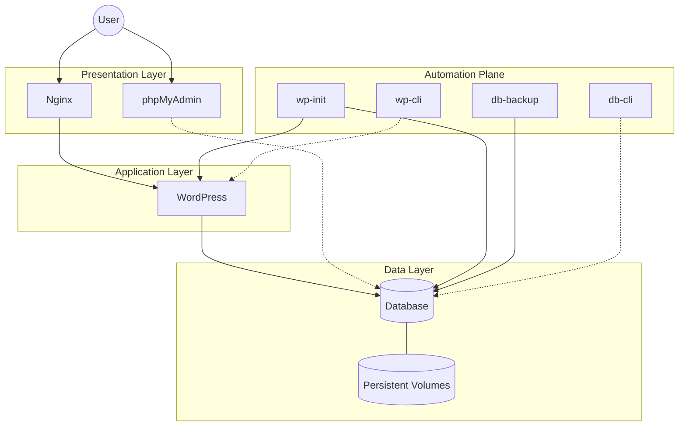

# WordPress Docker Stack

## Overview

A Docker Compose–based WordPress environment focused on automation, reproducibility, and separation of concerns.

This repository provides a structured and repeatable way to run and manage WordPress using containers. The stack relies on explicit configuration, script-driven automation, and a clear boundary between application logic and infrastructure responsibilities.

The objective is to offer a deterministic and extensible environment suitable for both straightforward WordPress setups and for more advanced development, migration, and data safety scenarios.

## Contents

- [Overview](#overview)
- [Typical Use Cases](#typical-use-cases)
- [Quick Start](#quick-start)
- [Configuration](#configuration)
- [Operational Interface](#operational-interface)
- [Architecture & Workflow](#architecture--workflow)
- [Design Decisions](#design-decisions)
- [Quality Gates and CI](#quality-gates-and-ci)
- [Contributions](#contributions)

## Typical Use Cases

This project supports multiple workflows that commonly emerge when working with WordPress:

1. **Fresh WordPress setup**  
   Run a new WordPress instance with minimal configuration using Docker Compose and environment variables.

2. **Import an existing WordPress project**  
   Reuse an existing WordPress installation by:
   - placing a database dump in `db/init/`
   - copying `wp-content` files into `src/`

   The database is automatically initialized on first startup or restored manually when needed.

3. **Environment migration and site URL synchronization**  
   When importing an existing database, the site URL stored in WordPress may not match the current environment (domain or port).  
   A dedicated initialization service detects the current site URL and synchronizes it with the configured environment to prevent redirect and startup issues.

4. **Continuous database safety**  
   Database content is backed up automatically at configurable intervals using a FIFO rotation policy.  
   Backups and on-demand snapshots can also be triggered manually.

## Quick Start

### Prerequisites

- Docker
- Docker Compose
- GNU Make

### Setup

Clone the repository and initialize the configuration:

```sh
git clone <repository-url>
cd wp-docker-stack
cp .env.example .env 
```

### Start the stack

Orchestrate and launch all services:

```sh
make up
```

### Access the services

* **WordPress:** Accessible at `http://<SERVER_NAME>:<HTTP_PORT>` as configured in your `.env` file.
* **Database Management:** Available via the database CLI (`db-cli`) or optional GUI tools such as phpMyAdmin.


### Stop the stack

Gracefully shut down all running services:

```sh
make down
```

## Configuration

The stack is driven by environment variables defined in the `.env` file. This approach keeps configuration explicit and avoids hardcoded values inside scripts or compose files.

### 1. Core Stack Settings
| Variable | Description |
| :--- | :--- |
| `CONTAINER_NAME` | Prefix used for all containers in the stack (e.g., `app`). |
| `SERVER_NAME` | Domain or hostname for the application (e.g., `localhost`). |
| `HTTP_PORT` | Host port mapped to the Nginx entry point (e.g., `8000`). |

### 2. Database Configuration
Configures the MySQL/MariaDB instance used by both the DB engine and WordPress.
* `DATABASE_NAME`, `DATABASE_USER`, `DATABASE_PASSWORD`
* `DATABASE_ROOT_PASSWORD`: Required for administrative tasks and CLI operations.

### 3. WordPress Initialization
Handles the automated setup and URL synchronization to ensure the site is always reachable.
* **`SKIP_WP_INIT`**: Set to `true` to disable the initialization service during `make up`.
* **`SITE_URL`**: The target WordPress URL. Supports dynamic expansion (e.g., `http://${SERVER_NAME}:${HTTP_PORT}`).
* **`SKIP_COLUMNS`**: Columns to exclude during the automated `search-replace` process (default: `guid`).

### 4. Database Backup Service
Manages automated snapshots and implements a data safety policy.
* **`SKIP_DB_BACKUP`**: Set to `true` to disable the automated backup service during `make up`.
* **`DATABASE_BACKUP_MAX_FILES`**: Number of historical snapshots to keep (**FIFO rotation policy**).
* **`DATABASE_BACKUP_INITIAL_DELAY`**: Wait time before the first backup (supports `s/m/h/d`, e.g., `60s`).
* **`DATABASE_BACKUP_INTERVAL`**: Frequency of subsequent backups.

### 5. Management Tools (Optional)
* **`PHPMYADMIN_PORT`**: Host port for the optional phpMyAdmin web interface.

## Operational Interface

The `Makefile` provides a stable, minimal interface for common operations:

### Core Targets
| Command | Description |
| :--- | :--- |
| `make up` | Build and start the environment. |
| `make down` | Stop all services. |
| `make clean` | Stop services and remove all volumes. |
| `make reset` | Full teardown (`clean`) and fresh restart (`up`). |
| `make logs` | Stream real-time logs from all containers. |

### Specialized Tasks
* **`make sync-site-url`**: Manually trigger site URL synchronization.
* **`make db-backup`**: Execute a one-off database backup.
* **`make db-restore SQLFILE=x.sql`**: Restore a specific dump from the `db/` directory.

## Architecture & Workflow

The stack is organized around a clear separation between application runtime,
infrastructure orchestration, and automation logic.

Docker Compose is used as the orchestration layer, while all non-trivial
operations (initialization, migration, synchronization, backups) are delegated
to explicit, service-scoped shell scripts.

This approach keeps the runtime predictable and avoids hidden behavior inside
custom images or implicit container side effects.

### High-Level Architecture

The following diagram provides a conceptual overview of how services interact
within the stack.



### Docker Compose Structure

The project is composed of two Compose files:

- `docker-compose.yml`  
  Defines the core services required to run WordPress:
  WordPress (PHP), database engine, Nginx, and shared volumes.

- `docker-compose.dev.yml`  
  Extends the base stack with development and operational tooling such as:
  initialization services, backup automation, CLI containers, and optional
  database management interfaces.

This layered approach allows the base stack to remain minimal, while enabling
additional functionality without modifying the core runtime definition.

### Service Responsibilities

Each container has a narrowly defined responsibility:

- **WordPress / Nginx**  
  Handle application runtime and HTTP traffic only.

- **Database service**  
  Provides persistent data storage via named volumes.

- **Initialization service (`wp-init`)**  
  Executes one-time or repeatable initialization tasks:
  database imports, site URL detection, and URL synchronization.

- **Data Safety (`db-backup`)**  
  Performs periodic database snapshots with a FIFO rotation policy.

- **CLI services (`wp-cli`, `db-cli`)**  
  Provide an always-available operational interface for manual maintenance
  and are reused internally by automation tasks.

Services communicate exclusively through Docker networks and volumes.
No container embeds logic that belongs to another lifecycle phase.

### Script-Driven Automation

All automation logic lives under the `scripts/` directory and is structured
by functional domain.

Each subdirectory maps directly to a service or shared concern, making the
relationship between containers and scripts explicit:

- service-specific logic is colocated with the service that executes it
- shared functionality (e.g. DB readiness checks, interval parsing) is
  extracted into reusable utilities

Scripts are POSIX-compliant, composable, and designed to be readable and
auditable. This makes execution order, side effects, and failure modes explicit.

### Workflow Overview

A typical workflow follows these steps:

1. Containers are started via `make up`.
2. Core services become available (database, WordPress, Nginx).
3. Optional initialization services run deterministic setup tasks.
4. Long-running automation (e.g. backups) operates independently.
5. Manual operations are performed via Make targets or CLI containers.

Each phase is isolated, repeatable, and observable, which simplifies debugging
and future extension.

### Extensibility

The architecture is intentionally open for extension:

- new initialization tasks can be added to `wp-init`
- additional automation services can be introduced without altering the core
  stack
- production-oriented overrides can be layered on top of the existing Compose
  files

This makes the project suitable both as a local development environment and as
a foundation for more advanced deployment scenarios.

## Design Decisions

Some design choices are intentionally opinionated and aimed at long-term
maintainability rather than short-term convenience:

- **Explicit automation over implicit behavior**  
  Initialization, migration, and backup logic are implemented as explicit
  scripts instead of being hidden inside container images or entrypoints.

- **Separation of lifecycle phases**  
  Runtime services, initialization tasks, and operational tooling are isolated
  into dedicated containers to avoid cross-responsibility coupling.

- **Configuration as data**  
  All behavioral changes are driven by environment variables, keeping scripts
  generic and reusable across environments.

These decisions favor clarity, debuggability, and extensibility over abstraction defaults.

## Quality Gates and CI

To preserve consistency and prevent configuration drift, the repository
includes a lightweight CI pipeline executed via GitHub Actions.

Each change is automatically validated against the following checks:

- **Shell scripts**  
  Linted using `shellcheck` to enforce correctness and portability.

- **Docker Compose and YAML files**  
  Validated for syntax and structural correctness.

- **Makefile targets**  
  Checked for consistency and common pitfalls.

- **Markdown documentation**  
  Optionally linted to enforce formatting and readability standards.

This ensures that infrastructure code, automation scripts, and documentation
evolve together in a controlled and reviewable way.

## Contributions

Contributions, improvements, and discussions are welcome.

The project is structured to make extension straightforward, whether by adding
new automation steps, introducing additional services, or adapting the stack
for different environments.

Pull requests are expected to follow the existing conventions and pass the
automated checks defined in the CI pipeline.