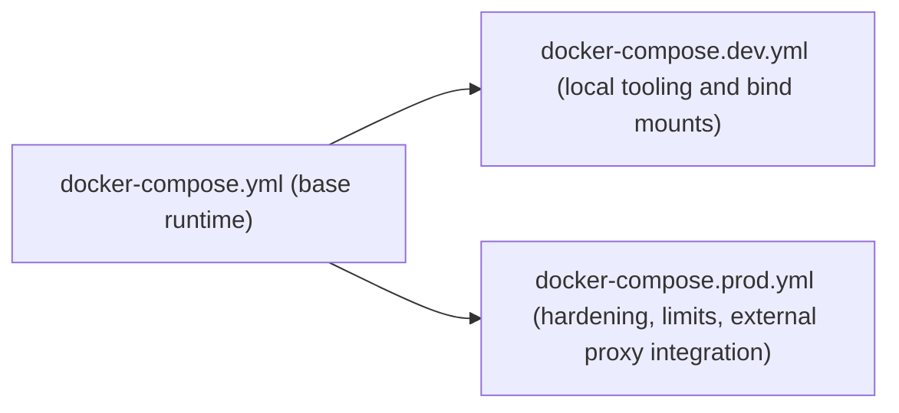

# WordPress Docker Stack


## Contents

- [Overview](#overview)
- [Reading Path](#reading-path)
- [Typical Use Cases](#typical-use-cases)
- [Quick Start (Development)](#quick-start-development)
- [Production Quick Start](#production-quick-start)
- [Configuration](#configuration)
- [Operational Interface](#operational-interface)
- [Architecture & Workflow](#architecture--workflow)
- [Design Decisions](#design-decisions)
- [Quality Gates and CI](#quality-gates-and-ci)
- [Extensibility](#extensibility)
- [Contributions](#contributions)

## Overview

A Docker Compose-based WordPress stack focused on automation, reproducibility, and clear separation of concerns.

This repository provides a structured way to run WordPress in both development and production, with explicit operational workflows for initialization, site URL migration, and scheduled database backups.

The design avoids hidden runtime behavior by moving lifecycle logic into auditable shell scripts and profile-specific Compose layers.

## Reading Path

This README keeps an incremental structure:

1. **Need a running environment quickly?**
   Start from [Quick Start (Development)](#quick-start-development).

2. **Need a deployable production profile?**
   Continue with [Production Quick Start](#production-quick-start).

3. **Need architecture and internals?**
   Go to [Architecture & Workflow](#architecture--workflow).

## Typical Use Cases

This project supports common WordPress workflows:

1. **Fresh WordPress setup**
   Start a new instance with minimal configuration using `make up` (development profile) or `make up-prod` (production profile).

2. **Import an existing WordPress project (development profile)**
   - place a database dump in `db/init/`
   - copy `wp-content` assets into `src/`

   The database can be initialized on first startup or restored manually with `make db-restore SQL_FILE=<file.sql>`.

3. **Environment migration and site URL synchronization**
   The `wp-init` sidecar reads the current `siteurl` and runs a controlled `wp search-replace` toward `SITE_URL` to avoid redirect and bootstrap issues.

4. **Continuous database safety**
   The `db-backup` sidecar creates periodic snapshots and enforces a FIFO retention policy.

## Quick Start (Development)

This is the fastest path to local usage.

### Prerequisites

- Docker
- Docker Compose
- GNU Make

### Setup

```sh
git clone <repository-url>
cd wp-docker-stack
cp .env.example .env
```

### Start

```sh
make up
```

### Access

- **WordPress:** `http://<SERVER_NAME>:<HTTP_PORT>` (defaults: `localhost:8000`)
- **phpMyAdmin (optional):** `http://localhost:<PHPMYADMIN_PORT>` (default: `8001`)

### Stop

```sh
make down
```

## Production Quick Start

The production profile applies hardening and resource controls, and expects an external reverse proxy.

### 1) Prepare environment variables

- Copy `.env.example` to `.env` if not already done.
- Set at least:
  - `SERVER_NAME` to your public host
  - `SITE_URL` to `https://<SERVER_NAME>` (recommended for production)

### 2) Ensure external proxy network exists

```sh
docker network create proxy
```

If the network already exists, Docker returns an "already exists" message and you can continue.

### 3) Start production profile

```sh
make up-prod
```

### 4) Route traffic from your reverse proxy

In your external proxy, route `SERVER_NAME` to `wp-docker-stack-nginx:80` on Docker network `proxy`.

### 5) Observe and stop

```sh
make logs-prod
make down-prod
```

## Configuration

All behavior is controlled through `.env`, keeping runtime logic explicit and image-agnostic.

### 1. Shared settings (development + production)

| Variable | Description |
| :--- | :--- |
| `SERVER_NAME` | Public hostname/domain used by Nginx and URL generation. |
| `DATABASE_NAME`, `DATABASE_USER`, `DATABASE_PASSWORD` | MySQL application credentials used by WordPress and sidecars. |
| `DATABASE_ROOT_PASSWORD` | MySQL root password (needed by administrative tools). |
| `SKIP_WP_INIT` | Skips `wp-init` tasks when `true`. |
| `SITE_URL` | Target WordPress URL used by the synchronization workflow. |
| `SKIP_COLUMNS` | Comma-separated columns excluded from `wp search-replace` (default: `guid`). |
| `SKIP_DB_BACKUP` | Disables the periodic backup sidecar when `true`. |
| `DATABASE_BACKUP_INITIAL_DELAY` | Delay before first backup (`s/m/h/d`). |
| `DATABASE_BACKUP_INTERVAL` | Backup frequency (`s/m/h/d`). |
| `DATABASE_BACKUP_MAX_FILES` | Maximum retained `.sql` backups (FIFO rotation). |

### 2. Development-only settings (`docker-compose.dev.yml`)

| Variable | Description |
| :--- | :--- |
| `HTTP_PORT` | Host port exposed by Nginx. |
| `PHPMYADMIN_PORT` | Host port for phpMyAdmin. |

Development profile also mounts:

- `./src` into `wp-content`
- `./db/init` for first-boot SQL initialization
- `./db/backups` for visible host-side backup files

### 3. Production-only settings (`docker-compose.prod.yml`)

| Variable | Description |
| :--- | :--- |
| `LOG_SIZE`, `LOG_FILES` | Per-container Docker log rotation limits. |
| `DB_CPUS`, `DB_MEM_LIMIT` | Resource limits for MySQL. |
| `WP_CPUS`, `WP_MEM_LIMIT` | Resource limits for WordPress (PHP-FPM). |
| `NGINX_CPUS`, `NGINX_MEM_LIMIT` | Resource limits for Nginx. |
| `WP_INIT_CPUS`, `WP_INIT_MEM_LIMIT` | Resource limits for one-shot `wp-init`. |
| `DB_BACKUP_CPUS`, `DB_BACKUP_MEM_LIMIT` | Resource limits for `db-backup`. |

Production profile uses named volume `db_backups` and external network `proxy`.

## Operational Interface

The `Makefile` provides a minimal and stable command surface.

### Development lifecycle

| Command | Description |
| :--- | :--- |
| `make up` | Build and start development services (`docker-compose.yml` + `docker-compose.dev.yml`). |
| `make down` | Stop development services. |
| `make clean` | Stop development services and remove volumes. |
| `make reset` | Full reset (`clean` + `up`). |
| `make logs` | Stream development logs. |

### Production lifecycle

| Command | Description |
| :--- | :--- |
| `make up-prod` | Start production services (`docker-compose.yml` + `docker-compose.prod.yml`). |
| `make down-prod` | Stop production services. |
| `make logs-prod` | Stream production logs. |

### Maintenance tasks (development profile)

| Command | Description |
| :--- | :--- |
| `make sync-site-url` | Manually trigger site URL synchronization. |
| `make db-backup` | Run one-off database backup. |
| `make db-restore SQL_FILE=<file.sql>` | Restore a dump from `db/init/` (basename only). |

## Architecture & Workflow

The runtime follows a three-tier application architecture with a dedicated operations plane.

### Compose layering model


```mermaid
flowchart LR
    Base["docker-compose.yml (base runtime)"] --> Dev["docker-compose.dev.yml (local tooling and bind mounts)"]
    Base --> Prod["docker-compose.prod.yml (hardening, limits, external proxy integration)"]
```

### System diagram

Solid arrows represent runtime traffic and dependencies. Dashed arrows represent operator and tooling interactions.

```mermaid
flowchart TB
    Visitor((Visitor))
    Operator((Operator))

    Proxy[External Reverse Proxy (prod)]
    ProxyNet[[proxy network (external, prod)]]

    subgraph Edge [Presentation Layer]
        Nginx[Nginx]
        PMA[phpMyAdmin (dev only)]
    end

    subgraph App [Application Layer]
        WP[WordPress]
    end

    subgraph Data [Data Layer]
        DB[(MySQL)]
        V_DB[(db_data volume)]
        V_WP[(wordpress volume)]
        V_BKP_DEV[./db/backups (dev bind mount)]
        V_BKP_PROD[(db_backups volume)]
    end

    subgraph Ops [Operations Plane]
        WP_INIT[wp-init]
        DB_BACKUP[db-backup]
        WP_CLI[wp-cli (dev only)]
        DB_CLI[db-cli (dev only)]
    end

    Visitor -. dev direct access .-> Nginx
    Visitor --> Proxy --> Nginx
    Proxy --- ProxyNet
    Nginx --- ProxyNet

    Nginx --> WP --> DB

    DB --- V_DB
    WP --- V_WP
    DB_BACKUP --- V_BKP_DEV
    DB_BACKUP --- V_BKP_PROD

    PMA -.-> DB
    WP_INIT --> WP
    WP_INIT --> DB
    DB_BACKUP --> DB
    WP_CLI -.-> WP
    DB_CLI -.-> DB

    Operator -.-> PMA
    Operator -.-> WP_CLI
    Operator -.-> DB_CLI
    Operator -.-> WP_INIT
    Operator -.-> DB_BACKUP
```

### Service responsibilities

| Service | Role | Profile |
| :--- | :--- | :--- |
| **Nginx** | Reverse proxy and static file entrypoint to PHP-FPM. | Dev + Prod |
| **WordPress** | Application runtime (PHP-FPM). | Dev + Prod |
| **Database** | Persistent MySQL storage via `db_data`. | Dev + Prod |
| **wp-init** | One-shot site URL detection and synchronization. | Dev + Prod |
| **db-backup** | Periodic backup and FIFO rotation. | Dev + Prod |
| **wp-cli** | Stateless maintenance shell for WordPress operations. | Dev only |
| **db-cli** | Stateless maintenance shell for MySQL restore/backup tasks. | Dev only |
| **phpMyAdmin** | Optional web GUI for DB inspection. | Dev only |

## Design Decisions

Key architectural choices:

- **Explicit automation over hidden entrypoint logic**
  Initialization, migration, and backup behavior is script-driven and auditable.

- **Environment-specific layering**
  A common base runtime is extended through dedicated development and production Compose profiles.

- **Operational sidecars for lifecycle tasks**
  URL sync, backup, and administrative operations are isolated from the main request-serving path.

- **Production hardening defaults**
  Production profile enables container log rotation, resource limits, `no-new-privileges`, and immutable-friendly service wiring through an external proxy network.

## Quality Gates and CI

The GitHub Actions pipeline (`.github/workflows/ci-lint.yml`) validates:

- **Shell scripts** using `shellcheck`
- **Compose/YAML syntax** using `yamllint`
- **Compose resolution** via `docker compose config` (base + development profile)
- **Makefiles** using `checkmake`
- **Markdown docs** using `markdownlint`

## Extensibility

The stack is designed to evolve without rewriting the core runtime:

- add new Compose overlays (for example `staging`)
- add new operational sidecars in `scripts/`
- integrate different reverse proxy frontends on the external `proxy` network
- extend backup policies or offload backups to external storage

## Contributions

Contributions are welcome. Please keep changes aligned with the layered architecture and ensure CI checks pass.
