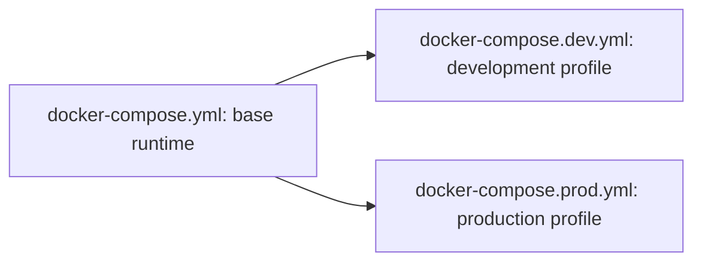
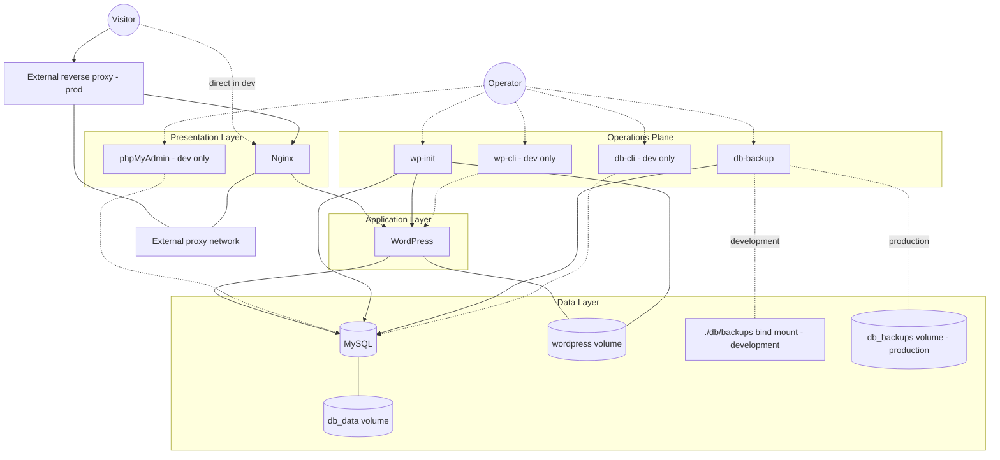

# WordPress Docker Stack


## Table of Contents

- [Overview](#overview)
- [Reading Guide](#reading-guide)
- [Typical Use Cases](#typical-use-cases)
- [Development Quick Start](#development-quick-start)
- [Production Quick Start](#production-quick-start)
- [Configuration](#configuration)
- [Operational Commands](#operational-commands)
- [Architecture & Workflow](#architecture--workflow)
- [Design Decisions](#design-decisions)
- [Quality Gates and CI](#quality-gates-and-ci)
- [Extensibility](#extensibility)
- [Contributions](#contributions)

## Overview

This repository provides a Docker Compose-based WordPress stack focused on repeatability, clear separation of concerns, and explicit operational workflows.

The project supports both development and production profiles, with script-driven automation for initialization, URL synchronization, and database backups.

## Reading Guide

- **I want to run it quickly:** Start from [Development Quick Start](#development-quick-start).
- **I want to deploy in production:** Continue with [Production Quick Start](#production-quick-start).
- **I want to understand internals:** Jump to [Architecture & Workflow](#architecture--workflow).

## Typical Use Cases

1. **Fresh WordPress setup:** Start a new instance with `make up` (development) or `make up-prod` (production).
2. **Import an existing WordPress project (development):** Place a SQL dump in `db/init/`, copy `wp-content` assets into `src/`, and use `make db-restore SQL_FILE=<file.sql>` when manual restore is needed.
3. **Environment migration and URL synchronization:** `wp-init` reads the current URL and runs a controlled `wp search-replace` toward `SITE_URL`.
4. **Continuous database safety:** `db-backup` runs periodic snapshots and applies FIFO retention.

## Development Quick Start

### Prerequisites

- Docker
- Docker Compose
- GNU Make

### Setup

```sh
git clone <repository-url>
cd wp-docker-stack
cp .env.example .env
```

### Start development stack

```sh
make up
```

### Access

- **WordPress:** `http://<SERVER_NAME>:<HTTP_PORT>` (default: `http://localhost:8000`)
- **phpMyAdmin (optional):** `http://localhost:<PHPMYADMIN_PORT>` (default: `8001`)

### Stop development stack

```sh
make down
```

## Production Quick Start

The production profile is designed to sit behind an external reverse proxy.

### Prepare environment variables

- Copy `.env.example` to `.env` (if not already done).
- Set `SERVER_NAME` to your public hostname.
- Set `SITE_URL` to `https://<SERVER_NAME>`.

### Prepare networking

Create the external proxy network (one-time operation):

```sh
docker network create proxy
```

If the network already exists, Docker reports it and you can continue.

### Start production stack

```sh
make up-prod
```

### View production logs

```sh
make logs-prod
```

### Route traffic

In your reverse proxy vhost for `SERVER_NAME`, forward traffic to the upstream alias `wp-docker-stack-nginx` on port `80` over Docker network `proxy`.

Example:

```nginx
location / {
    proxy_pass http://wp-docker-stack-nginx:80;
}
```

If you want a ready-to-use edge stack with Nginx and Certbot, see [Nginx Docker Reverse Proxy](https://github.com/taygumus/nginx-docker-reverse-proxy).

### Stop production stack

```sh
make down-prod
```

### Capacity planning (production)

Baseline sizing for typical small deployments:

| Scenario | vCPU | RAM | Notes |
| :--- | :--- | :--- | :--- |
| **Minimum** | 1 | 1 GB | Suitable for low traffic and small datasets. |
| **Recommended** | 2 | 2 GB | Better headroom for MySQL activity and plugin/theme load. |
| **Growth-ready** | 2-4 | 4 GB+ | Better resilience for spikes and heavier workloads. |

Typical idle/light-load footprint:

- **MySQL:** around `350-600 MB` (can increase with data size and query complexity)
- **WordPress PHP-FPM:** around `80-200 MB`
- **Nginx + sidecars:** around `40-120 MB`
- **Safety headroom:** keep at least `20-30%` free RAM

Runtime note: production resource values are declared in `deploy.resources`. Effective enforcement depends on your container runtime/orchestrator. Validate real usage on your host with `docker stats --no-stream`.

## Configuration

All behavior is controlled through `.env` values.

### Shared settings (all profiles)

| Variable | Description |
| :--- | :--- |
| `SERVER_NAME` | Public hostname/domain used by Nginx and URL generation. |
| `DATABASE_NAME`, `DATABASE_USER`, `DATABASE_PASSWORD` | MySQL app credentials used by WordPress and sidecars. |
| `DATABASE_ROOT_PASSWORD` | MySQL root password for administrative actions. |
| `SKIP_WP_INIT` | Skip `wp-init` tasks when set to `true`. |
| `SITE_URL` | Target WordPress URL used by synchronization. |
| `SKIP_COLUMNS` | Comma-separated columns excluded from `wp search-replace` (default: `guid`). |
| `SKIP_DB_BACKUP` | Disable periodic backup sidecar when set to `true`. |
| `DATABASE_BACKUP_INITIAL_DELAY` | Delay before first backup (`s/m/h/d`). |
| `DATABASE_BACKUP_INTERVAL` | Backup interval (`s/m/h/d`). |
| `DATABASE_BACKUP_MAX_FILES` | Maximum retained `.sql` files (FIFO). |

### Development settings (`docker-compose.dev.yml`)

| Variable | Description |
| :--- | :--- |
| `HTTP_PORT` | Host port mapped to Nginx. |
| `PHPMYADMIN_PORT` | Host port for phpMyAdmin. |

Development profile also mounts:

- `./src` into `wp-content`
- `./db/init` into MySQL init directory
- `./db/backups` for host-visible backup files

### Production settings (`docker-compose.prod.yml`)

| Variable | Description |
| :--- | :--- |
| `LOG_SIZE`, `LOG_FILES` | Container log rotation settings. |
| `DB_CPUS`, `DB_MEM_LIMIT` | Declared resource settings for MySQL. |
| `WP_CPUS`, `WP_MEM_LIMIT` | Declared resource settings for WordPress. |
| `NGINX_CPUS`, `NGINX_MEM_LIMIT` | Declared resource settings for Nginx. |
| `WP_INIT_CPUS`, `WP_INIT_MEM_LIMIT` | Declared resource settings for `wp-init`. |
| `DB_BACKUP_CPUS`, `DB_BACKUP_MEM_LIMIT` | Declared resource settings for `db-backup`. |

Production profile uses named volume `db_backups` and external network `proxy`.

## Operational Commands

`Makefile` is the main operational interface.

### Development lifecycle

| Command | Description |
| :--- | :--- |
| `make up` | Build and start development services (`docker-compose.yml` + `docker-compose.dev.yml`). |
| `make down` | Stop development services. |
| `make clean` | Stop development services and remove volumes. |
| `make reset` | Full reset (`clean` + `up`). |
| `make logs` | Stream development logs. |

### Production lifecycle

| Command | Description |
| :--- | :--- |
| `make up-prod` | Start production services (`docker-compose.yml` + `docker-compose.prod.yml`). |
| `make down-prod` | Stop production services. |
| `make logs-prod` | Stream production logs. |

### Maintenance commands (development profile)

| Command | Description |
| :--- | :--- |
| `make sync-site-url` | Trigger manual site URL synchronization. |
| `make db-backup` | Run one-off database backup. |
| `make db-restore SQL_FILE=<file.sql>` | Restore a dump from `db/init/` (basename only). |

## Architecture & Workflow

The stack follows a three-tier runtime model with a dedicated operations plane.

### Compose layering


```mermaid
flowchart LR
    Base["docker-compose.yml: base runtime"] --> Dev["docker-compose.dev.yml: development profile"]
    Base --> Prod["docker-compose.prod.yml: production profile"]
```

### System diagram

Solid arrows show runtime traffic/dependencies. Dashed arrows show operator and tooling interactions.


```mermaid
flowchart TB
    Visitor((Visitor))
    Operator((Operator))

    Proxy["External reverse proxy - prod"]
    ProxyNet["External proxy network"]

    subgraph Edge [Presentation Layer]
        Nginx[Nginx]
        PMA["phpMyAdmin - dev only"]
    end

    subgraph App [Application Layer]
        WP[WordPress]
    end

    subgraph Data [Data Layer]
        DB[(MySQL)]
        V_DB[(db_data volume)]
        V_WP[(wordpress volume)]
        V_BKP_DEV["./db/backups bind mount - development"]
        V_BKP_PROD[(db_backups volume - production)]
    end

    subgraph Ops [Operations Plane]
        WP_INIT[wp-init]
        DB_BACKUP[db-backup]
        WP_CLI["wp-cli - dev only"]
        DB_CLI["db-cli - dev only"]
    end

    Visitor -. direct in dev .-> Nginx
    Visitor --> Proxy --> Nginx
    Proxy --- ProxyNet
    Nginx --- ProxyNet

    Nginx --> WP --> DB

    DB --- V_DB
    WP --- V_WP
    WP_INIT --- V_WP
    DB_BACKUP -. development .- V_BKP_DEV
    DB_BACKUP -. production .- V_BKP_PROD

    PMA -.-> DB
    WP_INIT --> WP
    WP_INIT --> DB
    DB_BACKUP --> DB
    WP_CLI -.-> WP
    DB_CLI -.-> DB

    Operator -.-> PMA
    Operator -.-> WP_CLI
    Operator -.-> DB_CLI
    Operator -.-> WP_INIT
    Operator -.-> DB_BACKUP
```

### Service responsibilities

| Service | Role | Profile |
| :--- | :--- | :--- |
| **Nginx** | Reverse proxy and static entrypoint to PHP-FPM. | Development + Production |
| **WordPress** | Application runtime (PHP-FPM). | Development + Production |
| **Database** | Persistent MySQL storage (`db_data`). | Development + Production |
| **wp-init** | One-shot URL detection and synchronization. | Development + Production |
| **db-backup** | Periodic backup and FIFO rotation. | Development + Production |
| **wp-cli** | Stateless WordPress maintenance shell. | Development only |
| **db-cli** | Stateless MySQL maintenance shell. | Development only |
| **phpMyAdmin** | Optional DB web UI. | Development only |

## Design Decisions

- **Explicit automation:** initialization, migration, and backup behavior is script-driven and auditable.
- **Layered composition:** a shared base runtime is extended through development and production profiles.
- **Operational sidecars:** lifecycle tasks stay isolated from request-serving services.
- **Production hardening:** production profile adds logging policy, security options, and proxy-network integration.

## Quality Gates and CI

The GitHub Actions workflow (`.github/workflows/ci-lint.yml`) validates:

- Shell scripts with `shellcheck`
- Compose files with `yamllint`
- Compose resolution for base + development profile via `docker compose config`
- Makefiles with `checkmake`
- Markdown files with `markdownlint`

## Extensibility

This structure supports incremental growth without rewriting the core stack:

- add new Compose overlays (for example, staging)
- add new operational sidecars under `scripts/`
- integrate different reverse proxy frontends on network `proxy`
- extend backup retention and external backup destinations

## Contributions

Contributions are welcome. Please keep changes aligned with the layered architecture and ensure CI checks pass.
